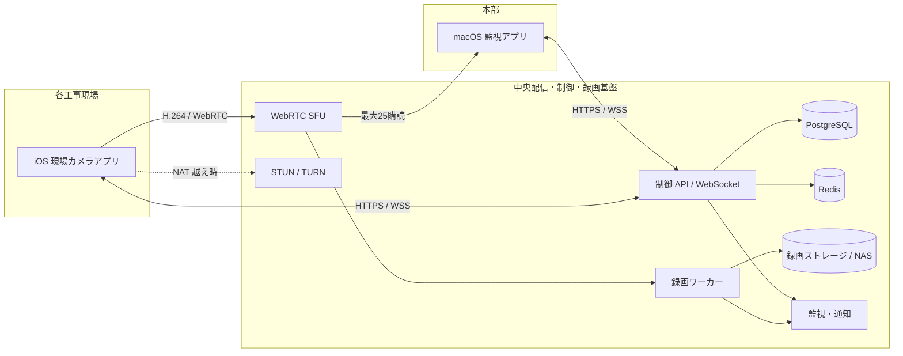
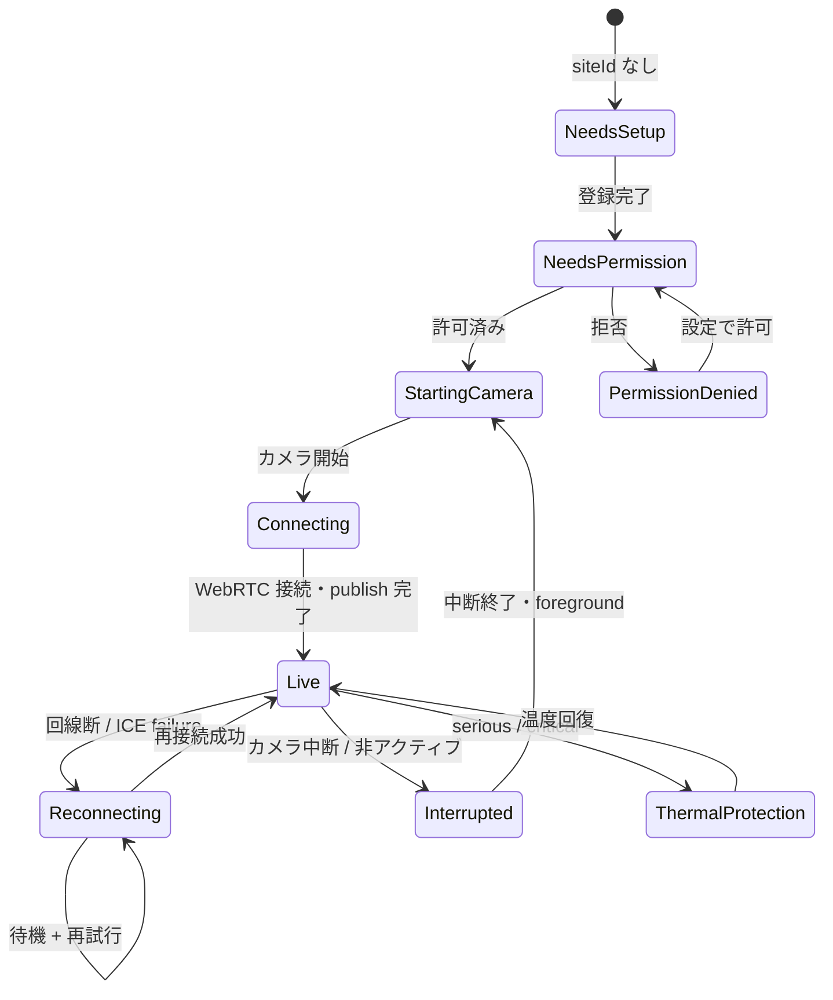

# 遠隔工事監視システム システム基本設計書

| 項目 | 内容 |
|---|---|
| 文書版 | 0.1 |
| 作成日 | 2026-08-28 |
| 状態 | 初期基本設計 |
| 対象 | 現場用 iOS アプリ、本部用 macOS アプリ、中央配信・制御・録画基盤 |

## 1. 目的

各工事現場に固定設置した iPhone の映像を、本部の Mac で低遅延に監視し、最大 25 映像を 1 画面へ並べ、必要に応じて録画・保管する。現場端末は無人に近い 24 時間 365 日運用を想定し、本部から画質を変更できるようにする。

本書は実装前の基本設計であり、採用する構成、責務、画面、状態遷移、録画、セキュリティおよび非機能要件を定める。

## 2. 対象範囲

### 2.1 今回の対象

- iPhone 初回起動時の工事名称登録
- iPhone 背面カメラによる常時プレビューとライブ送信
- iPhone 設定画面からの工事名称変更
- 本部 Mac から現場ごとの送信画質変更
- 本部 Mac で最大 25 映像を 16:9 タイル表示
- タイル左下の工事名称、右下の撮影タイムスタンプ
- 現場ごとの録画開始・停止および常時録画モード
- 録画の検索、再生、保存期間設定、自動削除
- 端末・配信・録画状態の監視と監査ログ

### 2.2 今回は対象外

- 音声送受信（プライバシーと帯域を考慮し、初期版は映像のみ）
- PTZ カメラ制御、ズームの遠隔操作
- AI 人物検知、車両検知、異常検知
- 現場側での長時間ローカル録画と回線復旧後の自動アップロード
- 一般利用者向け App Store 公開
- 複数本部間の権限委譲や顧客向けポータル

これらは中央基盤とサイト ID を再利用して後から追加できる構成とする。

## 3. 要件一覧

| ID | 要件 | 受入条件の概要 |
|---|---|---|
| IOS-01 | 初回起動時に工事名称を入力する | 未登録時は配信画面へ進まず、1〜80 文字の有効な名称を保存できる |
| IOS-02 | 名称登録後にカメラを起動して送信する | カメラ許可後、自動で接続・送信状態になる |
| IOS-03 | 設定から工事名称を変更する | 安定した siteId は変えず、表示名と名称履歴だけを更新する |
| IOS-04 | 24 時間 365 日の連続運用を想定する | 専用端末運用、再接続、熱保護、監視、電源復旧手順を備える |
| IOS-05 | 本部から画質を変更する | 指示を永続化し、端末が適用結果と実測値を応答する |
| MAC-01 | 複数現場をタイル表示する | 1 ページ最大 25、各タイル 16:9 |
| MAC-02 | 工事名称と時刻を重ねて表示する | 左下に名称、右下に `yyyy/MM/dd HH:mm:ss` とタイムゾーン |
| MAC-03 | 録画できる | 現場単位の手動録画と常時録画ポリシーを提供する |
| MAC-04 | 保存期間を変更できる | 管理者が全体既定値と現場別上書きを設定できる |
| SYS-01 | 回線・アプリ障害から自動復旧する | 指数バックオフ、状態監視、オフライン通知を実装する |
| SYS-02 | 映像と操作を保護する | 暗号化、端末認証、利用者認証、RBAC、監査ログを実装する |

## 4. 前提と暫定値

要件未確定部分は、初期設計を進めるため次の値を置く。実装開始時に確認して変更できる。

| 項目 | 暫定値 |
|---|---|
| 同時表示 | 25 現場 / 1 ページ |
| 登録現場数 | 100 現場までを初期サイジング対象とし、ページ切替で表示 |
| 映像 | 背面広角、横向き、16:9、音声なし |
| 標準画質 | 1280×720、15 fps、最大 800 kbps |
| ライブ遅延目標 | 通常回線で 95 パーセンタイル 2 秒以内 |
| タイムゾーン | Asia/Tokyo。保存時刻は UTC、表示は JST |
| 録画 | サーバー側。手動・常時の両モード、初期値は手動 |
| 保存期間 | 30 日、現場別上書き可 |
| iOS | 会社所有の専用 iPhone、監督対象、MDM 管理 |
| 対応 OS | 暫定で iOS 18 以降、macOS 15 以降。調達機種確定後に固定 |

## 5. 最重要の実現条件: iOS の 24 時間運用

### 5.1 制約

iOS の通常アプリは、バックグラウンドへ移行するとカメラ利用を継続できない。Apple はバックグラウンド移行時にカメラなどの共有資源を解放するよう求めており、`AVCaptureSession` にはバックグラウンドが原因の中断理由も定義されている。監視用途を VoIP と偽ってバックグラウンドモードを利用する設計は採らない。

したがって「利用者が他アプリへ切り替えたり画面をロックしたまま、監視カメラだけが無期限に動作する」という要件は、通常の iOS アプリとしては成立しない。

### 5.2 採用する運用方式

現場 iPhone を汎用電話ではなく、次の条件を満たす専用監視端末として運用する。

1. Apple Business Manager と MDM に登録し、端末を監督対象にする。
2. MDM の App Lock（Single App Mode）で現場アプリを唯一のアプリとして固定する。
3. 自動ロックとスリープ操作を禁止し、アプリを常時フォアグラウンドに保つ。
4. 常時給電、放熱、通信、固定具を含む設置基準を定める。
5. OS 更新は保守時間帯に MDM から計画実施する。
6. 再起動後に App Lock でアプリを再度開き、アプリ自身が自動接続・送信を再開する。

App Lock は再起動後に対象アプリを再度開けるが、電源断、OS 更新、ハード故障、回線断の間の映像を保証するものではない。完全な無停止・欠落なしが必須なら、業務用 IP カメラまたは現場ローカル録画を併設する必要がある。

さらに、パスコード付き iPhone は再起動後の「最初のロック解除」まで Wi-Fi 再参加や、保護された Keychain 資格情報の利用ができない場合がある。App Lock でアプリが開いても、そのまま送信まで復帰できるとは限らない。そのため次のいずれかを導入時の ADR（設計判断記録）で選ぶ。

- 可用性優先: パスコードを置かず、物理施錠、MDM、端末失効で保護する。
- 機密性優先: パスコードを置き、OS 更新・再起動時は現地担当者が初回解除する。
- 高可用性: 2 台の iPhone と独立回線を設け、更新・再起動を交互に行う。

停電による不用意な再起動を避けるため UPS を推奨する。上記方式は実機、採用 MDM、Wi-Fi/セルラー構成で必ず試験する。

## 6. 全体アーキテクチャ



### 6.1 なぜ中央基盤が必要か

利用者が操作するアプリは iOS と macOS の 2 つだが、次の機能は 2 アプリの直接通信だけでは安定して実現できない。

- 携帯回線・拠点ルーターの NAT やファイアウォールを越える接続
- 端末認証と短寿命の配信権限発行
- 本部 Mac が停止していても継続する録画
- 遠隔画質の希望値を保存し、オフライン端末へ再接続時に適用
- 状態監視、アラート、操作履歴、保存期間の一元管理
- 将来、本部 Mac を増やした際の送信帯域増加防止

中央基盤はユーザー向けの第 3 アプリではなく、システム内部の必須サービスである。

### 6.2 コンポーネント責務

| コンポーネント | 主な責務 |
|---|---|
| iOS 現場アプリ | 初期設定、撮影、エンコード、ライブ送信、遠隔設定適用、状態送信、自動復旧 |
| macOS 本部アプリ | 認証、現場一覧、最大 25 タイル表示、画質指示、録画操作、再生、保存設定 |
| 制御 API | 端末登録、認可、現場メタデータ、希望状態、録画ポリシー、監査ログ |
| 制御 WebSocket | 画質指示、状態変化、テレメトリー、録画状態のリアルタイム配信 |
| WebRTC SFU | 各 iPhone から 1 回受信し、Mac と録画ワーカーへ効率的に転送 |
| STUN/TURN | NAT 越え。直接 UDP が使えない場合に映像を中継 |
| 録画ワーカー | SFU の個別映像トラックをセグメント化して永続化 |
| PostgreSQL | 現場、端末、希望設定、録画索引、監査情報 |
| Redis | SFU クラスタ調停、一時状態、イベント配送。正本データにはしない |
| オブジェクトストレージ/NAS | 録画本体。暗号化、容量監視、ライフサイクル管理 |
| 監視・通知 | メトリクス、ログ、アラート、稼働ダッシュボード |

## 7. 技術選定

### 7.1 アプリ

| 領域 | 採用案 | 理由 |
|---|---|---|
| 言語 | Swift 6 系 | iOS/macOS 共通モデルを共有し、Apple API を直接利用できる |
| UI | iOS: SwiftUI + 必要箇所 UIKit、macOS: SwiftUI + 必要箇所 AppKit | 状態駆動 UI とネイティブ操作性を両立 |
| カメラ | AVFoundation | カメラ形式、フレームレート、向き、中断、システム負荷を管理できる |
| 映像伝送 | WebRTC | 低遅延、輻輳制御、暗号化、NAT 越えに適する |
| コーデック | H.264 | Apple 端末でのハードウェア支援と相互運用性を優先 |
| WebRTC 実装候補 | LiveKit Swift SDK + self-hosted LiveKit SFU/TURN | iOS/macOS の共通 SDK、SFU、TURN、録画機構を利用可能 |
| 依存管理 | Swift Package Manager | Apple 標準。採用版を固定し、更新試験後に昇格する |

LiveKit は現時点の第一候補であり、PoC で 25 同時受信、24 時間連続、H.264 再設定、録画負荷を検証して最終決定する。アプリ内部には `MediaTransport` 抽象を置き、SDK 固有型が UI やドメイン層へ漏れないようにする。

### 7.2 バックエンド

| 領域 | 採用案 |
|---|---|
| 制御 API/ワーカー | Go または組織標準のサーバー言語。REST + WebSocket |
| DB | PostgreSQL |
| 一時状態・クラスタ | Redis |
| 配信 | LiveKit SFU/TURN の冗長構成 |
| 録画 | 個別トラック Egress、短いセグメントで保存 |
| 保存 | S3 互換オブジェクトストレージまたは本部 NAS + オブジェクトゲートウェイ |
| 観測 | OpenTelemetry、Prometheus 互換メトリクス、集中ログ |

## 8. iOS 現場アプリ設計

### 8.1 画面

| 画面 | 内容 |
|---|---|
| 初期設定 | 工事名称、端末アクティベーションコードまたは MDM 配布設定の確認 |
| カメラ権限 | 使用目的説明、システム権限要求、拒否時の設定誘導 |
| 配信画面 | 全画面プレビュー、LIVE/接続中/オフライン、適用画質、最終送信時刻、設定ボタン |
| 設定 | 工事名称変更、端末・アプリ情報、接続診断、管理者 PIN 付き保守操作 |
| 障害表示 | 権限不足、端末未登録、カメラ中断、熱保護、回線断。映像の上に原因と自動再試行状態を表示 |

### 8.2 初回起動フロー

1. MDM の Managed App Configuration または一回限りのアクティベーションコードから組織・端末を登録する。
2. 工事名称を入力する。前後空白を除去し、1〜80 文字、改行・制御文字なしで検証する。
3. バックエンドが安定した `siteId` と `deviceId` を発行する。表示名は ID に使わない。
4. 端末資格情報を Keychain に保存する。
5. カメラ利用目的を説明してからシステム権限を要求する。
6. 横向き 16:9 の背面広角カメラを開始する。
7. 短寿命の WebRTC 接続トークンを取得し、映像を publish する。
8. `LIVE` になったこと、工事名称、実際の解像度/fps/ビットレートを表示する。

工事名称を変えても `siteId`、録画、監査履歴は継続する。録画索引には撮影当時の名称スナップショットも残す。

### 8.3 配信状態機械



### 8.4 カメラ・エンコード

- `AVCaptureSession` の構成と start/stop は専用直列実行コンテキストで行い、UI スレッドを塞がない。
- 背面広角カメラを既定とし、横向き 16:9 へ固定する。端末が物理的に縦向きでも送信映像は設置時に定めた横向きとする。
- 自動露出・オートフォーカスを基本にし、暗所や逆光の状況は設置試験で確認する。
- ネイティブな bi-planar YCbCr ピクセル形式を優先し、不要な BGRA 変換を避ける。遅延フレームは蓄積せず、常に最新フレームを優先する。
- カメラ中断通知、ランタイムエラー、メディアサービスリセットを監視し、安全にセッションを再構築する。
- H.264 のキーフレーム間隔は約 2 秒を初期値とし、接続・録画の復旧時間を短くする。
- 音声セッションとマイク権限は初期版では使用しない。

### 8.5 画質プロファイル

| プロファイル | 解像度 | fps | 最大映像ビットレート | 主な用途 |
|---|---:|---:|---:|---|
| LOW | 640×360 | 10 | 250 kbps | 回線不良、25 画面の軽量監視 |
| STANDARD | 1280×720 | 15 | 800 kbps | 通常運用の既定値 |
| HIGH | 1920×1080 | 20 | 2,000 kbps | 重点確認。常時利用は熱・容量検証後 |

本部の設定値は「希望上限」である。WebRTC の輻輳制御、端末性能、温度、対応形式により実測値は下がり得る。Mac には `希望: STANDARD / 実測: 960×540 12fps 620kbps / 理由: NETWORK` のように表示する。

適用順序は、可能ならまずエンコーダーの最大ビットレートと fps を変え、解像度変更が必要な場合だけキャプチャ形式を再構成する。映像断は 2 秒以内を目標とする。

### 8.6 遠隔画質制御

- Mac は制御 API へ希望プロファイルを登録する。
- API は現場ごとに単調増加する `revision` を払い出し、希望状態を DB に保存してから端末へ通知する。
- iPhone は古い revision を無視し、対応可能範囲へ clamp して適用する。
- iPhone は `APPLIED`、`DEGRADED`、`REJECTED` のいずれかと実測値・理由を ACK する。
- ACK がない場合も希望状態は失われず、再接続時の同期で再送される。
- 同じ commandId の再送は冪等に処理する。

#### 表示画質と送信・録画画質

画質には意味の異なる 2 種類があるため、内部モデルと Mac UI で分ける。

| 種類 | 変更対象 | 主な影響 | 制御 |
|---|---|---|---|
| 表示画質 | Mac が SFU から購読するレイヤー | Mac の下り帯域、デコード負荷、タイルの見え方 | タイルサイズに応じて自動。選択時は手動変更可 |
| 送信・録画画質 | iPhone のキャプチャ・エンコード上限 | 現場上り帯域、端末温度、録画品質・容量 | 本部オペレーターが遠隔指定し、iPhone が ACK |

PoC では単一レイヤーと 2 レイヤー simulcast を比較する。常時 3 レイヤー送信は通信量と熱負荷が大きいため初期案では採らない。5×5 表示は 360p 程度、選択した 1 タイルは 720p/1080p を購読する構成を第一候補とし、録画が高レイヤーを常時必要とする場合の現場側負荷も測定する。

### 8.7 自動復旧

- `NWPathMonitor` と WebRTC 接続状態を監視する。
- 再試行は 1、2、4、8、15、30 秒 + ジッターとし、以後 30 秒間隔を上限に継続する。
- Wi-Fi/セルラー切替時は ICE restart またはセッション再接続を行う。
- 10 秒以上映像フレームが送られない場合はキャプチャ・エンコーダー・接続を段階的に再構築する。
- アプリ再起動時は Keychain の端末 ID とローカル保存した siteId を読み、利用者操作なしで復帰する。
- クラッシュ回数と直前状態を次回起動時に中央へ送る。秘密情報や映像をログへ残さない。

### 8.8 熱・電源保護

- `ProcessInfo.thermalState` とカメラの system pressure を監視する。
- `fair`: テレメトリーのみ。
- `serious`: 画質を 1 段階下げ、画面輝度を最低限へ誘導し、本部へ警告する。
- `critical`: LOW へ下げる。なお継続不能ならカメラを一時停止し、冷却後に自動復帰する。
- 遠隔 HIGH 指示より端末保護を優先する。復帰後、保存済みの希望値へ段階的に戻す。
- 常時給電でもバッテリー膨張・劣化は起こり得るため、温度、充電状態、筐体、直射日光を運用点検の対象とする。

## 9. macOS 本部アプリ設計

### 9.1 主画面

主画面は次の領域で構成する。

- 上部ツールバー: 接続状態、オンライン数、ページ、検索、全画面、設定
- 中央: 16:9 タイルグリッド
- 任意の右サイドバー: 選択現場の実測値、画質、録画、障害、最終接続
- 通知領域: オフライン、録画異常、容量不足、時刻ずれ

### 9.2 グリッド規則

| 表示現場数 | 行列 |
|---:|---|
| 1 | 1×1 |
| 2〜4 | 2×2 |
| 5〜9 | 3×3 |
| 10〜16 | 4×4 |
| 17〜25 | 5×5 |

- 1 ページの上限は 25。26 現場以上はページまたは保存済みグループで切り替える。
- 各タイルのコンテンツ領域は常に 16:9 とし、映像は原則 aspect-fit で表示する。元映像と比率が異なる場合は切り取らず黒帯を入れる。
- 4K 全画面では 5×5 を推奨する。通常ウィンドウで高さが不足する場合はグリッド全体を縮小し、必要ならページを分ける。
- タイル順は手動並べ替えを保存できる。オフライン現場を勝手に詰めず、監視位置を安定させる。

### 9.3 タイル表示

各タイルは次を表示する。

- 映像または黒背景の状態プレースホルダー
- 左下: 工事名称。1 行、省略表示、ホバーで全文
- 右下: 撮影時刻 `yyyy/MM/dd HH:mm:ss JST`
- 左上: LIVE、再接続中、OFFLINE、カメラ中断、熱警告
- 右上: 録画中の赤丸と経過時間
- 枠色: 通常は無色、選択は青、警告は黄、異常は赤。ただし色だけに依存しない

下部には半透明の黒グラデーションを敷き、明るい現場でも白文字を読めるようにする。工事名称とタイムスタンプは macOS 上の表示オーバーレイであり、既定では録画映像へ焼き込まない。証跡用エクスポート時には焼き込み版を生成できる余地を残す。

映像停止時は最後のフレームを暗く固定し、右下の撮影時刻も進めない。中央に `OFFLINE` または `再接続中` と経過時間を大きく表示し、静止画をライブ映像と誤認させない。長時間停止時に黒背景へ切り替える時間は UI 試験で決める。

### 9.4 タイムスタンプ

- iPhone は 1 秒ごとに「端末壁時計 UTC + monotonic uptime + 現在の RTP/メディア時刻に対応する識別値」をメタデータ送信する。
- サーバーは heartbeat の往復時間から時計ずれを見積もり、補正量を配布する。
- Mac は補正済みの撮影時刻をフレーム進行に合わせて表示する。
- 時刻差が 5 秒を超えた場合は `時刻未同期` を表示し、受信時刻を併記する。
- DB は UTC、画面は JST。夏時間のある地域へ展開しても同じ設計を使える。

### 9.5 操作

- クリック: 現場を選択し、サイドバーを表示
- ダブルクリック: 単一現場を全画面表示。戻ると元の並びを維持
- 画質: LOW/STANDARD/HIGH を現場単位、複数選択、全現場に指示可能
- 録画: 現場単位で開始・停止。常時録画ポリシーの場合は手動停止不可または管理者確認を要求
- スナップショットは今回の要件外とし、初期版には含めない

### 9.6 画面一覧

| 画面 | 主な機能 |
|---|---|
| ログイン | 組織アカウント認証、多要素認証は IdP 側で実施 |
| ライブ監視 | 最大 25 タイル、ページ/グループ、状態確認 |
| 現場詳細 | 拡大映像、希望/実測画質、回線統計、端末温度、録画操作 |
| 録画検索 | 現場、日時、録画状態で検索、タイムライン、再生、権限付き書き出し |
| システム設定 | 保存期間、録画既定モード、表示順、通知 |
| 端末管理 | 登録、無効化、最終接続、アプリ/OS バージョン |
| 監査ログ | 名称、画質、録画、保存期間、端末操作の履歴 |

## 10. 録画・保存設計

### 10.1 中央録画を採用する理由

macOS アプリ自身にだけ録画させると、アプリ終了、Mac のスリープ、ユーザーログアウト、再起動、表示ページ切替によって録画が止まる。中央録画ワーカーを SFU に接続し、Mac の状態と無関係に録画する。

### 10.2 録画モード

| モード | 動作 |
|---|---|
| OFF | ライブのみ。録画ボタンで手動開始可能 |
| MANUAL | オペレーターが開始し、停止するまで中央で継続 |
| CONTINUOUS | 現場がオンラインになるたび自動録画。回線復旧時は新セグメントで再開 |

初期値は MANUAL とするが、監視目的に応じて管理者が既定値を変更できる。

### 10.3 ファイル方式

- 現場ごとに個別トラックを録画し、25 画面を合成した映像だけにはしない。
- 5 分程度のメディアオブジェクトを基本にし、その内部を約 10 秒の fMP4 フラグメントにする。これによりオブジェクト数を抑えつつ、異常終了時に部分回復しやすくする。採用 Egress が HLS セグメントを直接生成する場合は、セグメント数と索引負荷を実測して調整する。
- 1 時間単位の論理録画セッションとして検索画面へ表示する。
- ダウンロード時に MP4 へ再パッケージし、必要なら名称・時刻オーバーレイを焼き込む。
- セグメント確定後にサイズと SHA-256 を記録し、破損検査を可能にする。
- 証跡性が必要な導入では、前オブジェクト hash を含む hash chain とサーバー署名/HMACを追加する。単純な SHA-256 だけでは、悪意ある全体差し替えを防げない。

### 10.4 保存期間

- 全体既定値: 30 日
- 現場別上書き: 任意
- 設定可能範囲: 1〜3650 日（権限と容量確認が必要）
- 各録画に `deleteAfter = endAt + effectiveRetentionDays` を確定する。
- 保存期間を短縮すると既存録画にも適用する。削除見込み件数・容量を事前表示し、管理者に再確認する。
- 削除ジョブは期限超過データを毎時処理し、24 時間以内に本体と索引を削除する。
- 法的保全が将来必要になった場合に備え、`hold` フラグを追加可能なモデルにする。初期 UI では提供しない。

### 10.5 容量不足時

1. 期限切れ録画を優先削除する。
2. 空き 20% 未満で警告、10% 未満で重大警告を出す。
3. 期限内録画を無断削除しない。
4. 空きが安全下限を割った場合、新規録画を停止して明示的に異常表示する。
5. 「古いものから期限内でも上書きする」非常時循環モードは、別途明示設定した場合だけ許可する。

## 11. データモデル概要

| エンティティ | 主な属性 |
|---|---|
| Organization | id, name, timezone, defaultRetentionDays |
| Site | id, organizationId, displayName, nameVersion, desiredQuality, recordingMode, retentionOverrideDays |
| SiteNameHistory | siteId, displayName, validFrom, validTo, changedBy |
| Device | id, siteId, model, osVersion, appVersion, credentialStatus, lastSeenAt |
| StreamSession | id, siteId, deviceId, startedAt, endedAt, endReason |
| DesiredQuality | siteId, revision, profile, constraints, requestedBy, requestedAt |
| QualityApplication | commandId, deviceId, revision, result, actualMetrics, reason, appliedAt |
| Recording | id, siteId, mode, startedAt, endedAt, status, siteNameSnapshot, deleteAfter |
| RecordingSegment | id, recordingId, startAt, endAt, objectKey, bytes, sha256, codec, resolution, status |
| AuditEvent | id, actorType, actorId, action, targetType, targetId, before, after, occurredAt |

名称は主キーにしない。1 現場に原則 1 台の送信端末を割り当て、交換時は同じ siteId へ新 deviceId を関連付ける。

## 12. セキュリティ設計

### 12.1 認証・認可

- iPhone: 一回限りの登録トークンで bootstrap し、端末鍵を生成する。長期秘密は Keychain に保存する。
- WebRTC: API が 5 分程度の短寿命・最小権限トークンを発行する。iPhone は自分の映像だけ publish、本部は subscribe のみ。
- Mac: OIDC/OAuth 2.0 の組織 IdP を利用する。ローカル共有パスワードは採用しない。
- 権限:
  - Viewer: ライブ・録画の閲覧
  - Operator: 画質変更、手動録画、書き出し
  - Administrator: 保存期間、常時録画、端末登録、利用者権限
- すべての変更操作に actor、対象、前後値、時刻、結果を残す。

### 12.2 暗号化

- API と signaling は TLS 1.2 以上、運用基準は TLS 1.3 を優先する。
- WebRTC メディアは DTLS-SRTP による通信路暗号化を使う。
- DB、録画ストレージ、バックアップを保存時暗号化する。
- サーバー側録画では録画ワーカーが平文フレームへアクセスするため、純粋な送信端末〜Mac 間 E2EE とは両立しない。E2EE が必須なら、信頼済み録画参加者への鍵配布・ローテーションを別設計する。

### 12.3 脅威と対策

| 脅威 | 対策 |
|---|---|
| 未登録端末の映像投稿 | 一回限り登録、端末資格情報、短寿命 publish token |
| 他現場へのなりすまし | token に siteId と publish 対象を固定、表示名を権限判断に使わない |
| 画質・録画の不正操作 | Mac 利用者認証、RBAC、CSRF 不要なネイティブ token flow、監査ログ |
| token 盗難 | Keychain、短寿命 access token、refresh token ローテーション、遠隔失効 |
| 録画流出 | 保存時暗号化、最小権限、期限削除、書き出し監査 |
| 制御イベントのリプレイ | commandId、revision、期限、冪等処理 |
| ログからの秘密漏えい | token・映像・個人情報をログに出さず、構造化された診断値のみ保持 |

### 12.4 プライバシー

- 初期版は音声を取得しない。
- iOS のカメラ利用表示を隠さない。
- 現場の撮影範囲、掲示、就業規則、第三者の映り込み、録画閲覧権限について、導入組織が法務・労務・個人情報保護の確認を行う。
- 技術的には必要最小限の画角、保存期間、閲覧者に制限する。

## 13. 非機能要件

数値は PoC と実機試験で確定する暫定 SLO である。

| 分類 | 目標 |
|---|---|
| ライブ遅延 | 良好な LTE/5G/Wi-Fi で glass-to-glass p95 2 秒以内 |
| 初回表示 | オンライン現場を選択後 p95 5 秒以内に最初のフレーム |
| 画質指示 | オンライン時 p95 5 秒以内に ACK、解像度切替を含め 10 秒以内 |
| 再接続 | 一過性の回線断復旧後 p95 30 秒以内 |
| タイル | 25 本同時に UI 応答性を維持し、オーバーレイを正しく表示 |
| 録画損失 | 録画ワーカー異常時、確定済みセグメントを保全し未確定 1 セグメント以内 |
| 保存期間 | 期限から 24 時間以内に削除完了 |
| 時計 | 通常は中央基準との差 1 秒以内、5 秒超で警告 |
| 可用性 | 中央基盤 99.9%/月を目標。現場回線・電源を含む端末単位は別 SLO |
| アクセシビリティ | 状態を色だけで表現せず、キーボード操作と VoiceOver ラベルを提供 |

「24 時間 365 日稼働」は運用時間帯を表し、無停止保証そのものではない。SLA が必要なら、回線二重化、電源バックアップ、交換端末、冗長サーバー、保守窓、障害連絡体制を契約要件として別途定義する。

## 14. プロジェクト構成案

実装時は次の構成を推奨する。

```text
RemoteConstructionMonitor/
├── Apps/
│   ├── FieldCamera-iOS/
│   └── HeadquartersMonitor-macOS/
├── Packages/
│   ├── DomainModels/
│   ├── ControlClient/
│   ├── MediaTransport/
│   └── DesignSystem/
├── Services/
│   ├── control-api/
│   ├── retention-worker/
│   └── recording-orchestrator/
├── Infrastructure/
│   ├── livekit/
│   ├── database/
│   └── observability/
└── docs/
```

アプリ間で共有するのは純粋なモデル、API schema、状態表現に限定する。iOS と macOS の画面コード、ライフサイクル、権限処理は分離する。

## 15. 要件トレーサビリティ

| ユーザー要件 | 設計箇所 |
|---|---|
| 初回起動で工事名称入力 | 8.1、8.2 |
| 入力後カメラ起動・本部へリアルタイム伝送 | 6、7、8.2〜8.4 |
| 設定から名称変更 | 8.1、8.2、11 |
| iOS を 24/7 稼働 | 5、8.7、8.8、13 |
| 本部から画質変更 | 8.5、8.6、および API・イベント設計書 |
| 本部でタイル表示 | 9.1、9.2 |
| 16:9、1 画面 25 タイル | 9.2 |
| 左下に工事名称 | 9.3 |
| 右下にタイムスタンプ | 9.3、9.4 |
| 録画機能 | 9.5、9.6、10 |
| 保存期間を設定変更 | 10.4、10.5 |

## 16. 根拠資料

- Apple: [Preparing your UI to run in the background](https://developer.apple.com/documentation/uikit/preparing-your-ui-to-run-in-the-background)
- Apple: [AVCaptureSession.InterruptionReason.videoDeviceNotAvailableInBackground](https://developer.apple.com/documentation/AVFoundation/AVCaptureSession/InterruptionReason/videoDeviceNotAvailableInBackground)
- Apple: [Configuring background execution modes](https://developer.apple.com/documentation/Xcode/configuring-background-execution-modes)
- Apple: [App Review Guidelines 2.5.4](https://developer.apple.com/app-store/review/guidelines/)
- Apple: [App Lock device management payload settings](https://support.apple.com/en-euro/guide/deployment/dep80a981/web)
- Apple: [Set Single App Mode in Apple Configurator](https://support.apple.com/en-ie/guide/apple-configurator-mac/cadbf9c172/mac)
- Apple: [ProcessInfo.ThermalState](https://developer.apple.com/documentation/foundation/processinfo/thermalstate-swift.enum)
- Apple: [NWPathMonitor](https://developer.apple.com/documentation/network/nwpathmonitor)
- Apple: [Restart Device command](https://developer.apple.com/documentation/devicemanagement/restart-device-command)
- Apple: [TN3121: Selecting a pixel format for an AVCaptureVideoDataOutput](https://developer.apple.com/documentation/technotes/tn3121-selecting-a-pixel-format-for-an-avcapturevideodataoutput)
- Apple: [Creating a camera experience for the Lock Screen](https://developer.apple.com/documentation/lockedcameracapture/creating-a-camera-experience-for-the-lock-screen)
- WebRTC: [Getting started with peer connections](https://webrtc.org/getting-started/peer-connections)
- WebRTC: [TURN server](https://webrtc.org/getting-started/turn-server)
- LiveKit: [iOS/macOS Swift SDK](https://github.com/livekit/client-sdk-swift)
- LiveKit: [Self-hosted deployment and TURN](https://docs.livekit.io/transport/self-hosting/deployment/)
- LiveKit: [Recording and composition](https://docs.livekit.io/egress-ingress/egress/overview/)
- LiveKit: [Encryption overview](https://docs.livekit.io/transport/encryption/)
- LiveKit: [Codecs, simulcast and dynacast](https://docs.livekit.io/transport/media/advanced/)
- RFC 8827: [WebRTC Security Architecture](https://www.rfc-editor.org/rfc/rfc8827.html)
- RFC 8836: [Congestion Control Requirements for Interactive Real-Time Media](https://www.rfc-editor.org/rfc/rfc8836.html)
- Apple: [Custom app distribution](https://developer.apple.com/support/volume-purchase-and-custom-apps/)
