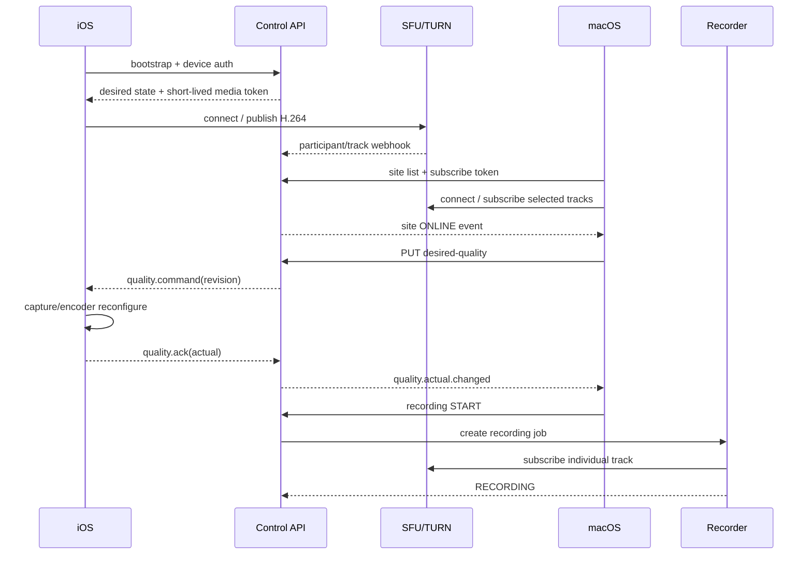

# 遠隔工事監視システム API・イベント設計書

| 項目 | 内容 |
|---|---|
| 文書版 | 0.1 |
| 作成日 | 2026-08-28 |
| 対象 | 制御 API、制御 WebSocket、メディア接続境界 |

## 1. 方針

- 映像そのものは REST/WebSocket に載せず、WebRTC SFU を経由する。
- REST は登録、照会、希望状態の更新、録画操作に使う。
- WebSocket は状態・指示・ACK・テレメトリーの低遅延通知に使う。
- PostgreSQL の希望状態を正本とし、WebSocket メッセージだけに依存しない。
- すべての日時は RFC 3339 UTC、ID は UUID v7 または同等の時間順 UUID とする。
- API prefix は `/v1`。破壊的変更時のみ major version を上げる。
- JSON の未知フィールドは無視し、未知の enum 値は `UNKNOWN` として安全側で処理する。

## 2. 認証主体と権限

| 主体 | 認証 | 許可 |
|---|---|---|
| 未登録 iPhone | 一回限り activation token | 自端末の登録だけ |
| 登録済み iPhone | 端末鍵 + rotating refresh credential | 自 site の取得、名称更新、状態送信、publish token 取得 |
| Mac Viewer | OIDC access token | 許可された site の表示・録画再生 |
| Mac Operator | OIDC access token | Viewer + 画質変更、手動録画、書き出し |
| Mac Administrator | OIDC access token | Operator + 保存期間、録画ポリシー、端末失効 |
| 内部録画ワーカー | workload identity | 対象 track の購読、録画メタデータ更新 |

WebRTC token は制御 API だけが発行し、5 分程度の短寿命とする。iPhone token は `canPublish=true`、`canSubscribe=false`、発行対象の participant identity を固定する。本部/録画 token は必要な room と subscribe だけを許可する。

## 3. 共通 HTTP 仕様

### 3.1 Header

```http
Authorization: Bearer <access-token>
Content-Type: application/json
Accept: application/json
X-Request-Id: <uuid>
Idempotency-Key: <uuid>   # 状態を変える POST で必須
```

### 3.2 エラー形式

```json
{
  "error": {
    "code": "SITE_NAME_INVALID",
    "message": "工事名称は1〜80文字で入力してください。",
    "requestId": "01992f31-0d1c-7a1e-8f1b-72e16f5d2d30",
    "details": {
      "field": "displayName"
    }
  }
}
```

| HTTP | 代表コード | 意味 |
|---:|---|---|
| 400 | VALIDATION_ERROR | 入力不正 |
| 401 | TOKEN_INVALID | 未認証・期限切れ |
| 403 | PERMISSION_DENIED | 権限不足 |
| 404 | SITE_NOT_FOUND | 対象なし |
| 409 | VERSION_CONFLICT | 楽観ロック競合 |
| 422 | COMMAND_UNSUPPORTED | 端末能力外 |
| 429 | RATE_LIMITED | 頻度超過 |
| 503 | MEDIA_SERVICE_UNAVAILABLE | 配信基盤利用不可 |

## 4. 主要 REST API

### 4.1 iPhone アクティベーション

`POST /v1/devices/activate`

```json
{
  "activationToken": "one-time-secret",
  "displayName": "○○道路改良工事",
  "device": {
    "installationId": "local-random-uuid",
    "platform": "IOS",
    "model": "iPhone",
    "osVersion": "18.0",
    "appVersion": "1.0.0"
  },
  "publicKey": "base64-spki"
}
```

成功 `201 Created`:

```json
{
  "organizationId": "01992f31-...",
  "siteId": "01992f32-...",
  "deviceId": "01992f33-...",
  "deviceCredential": "returned-once",
  "controlWebSocketUrl": "wss://control.example.jp/v1/device-events",
  "effectiveConfig": {
    "displayName": "○○道路改良工事",
    "desiredQualityRevision": 1,
    "desiredQualityProfile": "STANDARD",
    "recordingMode": "MANUAL"
  }
}
```

activation token は一度成功したら再利用不可とする。レスポンスの資格情報は再表示しない。

### 4.2 自端末 bootstrap

`GET /v1/device/bootstrap`

アプリ起動・再接続時に呼び、site、最新希望画質、時刻補正、heartbeat 間隔、WebRTC 接続情報を取得する。

### 4.3 工事名称変更

`PATCH /v1/sites/{siteId}`

```json
{
  "displayName": "○○道路改良工事 第2工区",
  "expectedNameVersion": 3
}
```

成功時は `nameVersion: 4` を返す。競合時は 409 と現在値を返す。変更元が iPhone でも Mac 管理者でも同じ監査処理を通す。

### 4.4 現場一覧

`GET /v1/sites?cursor=...&limit=100&status=ONLINE`

```json
{
  "items": [
    {
      "siteId": "01992f32-...",
      "displayName": "○○道路改良工事",
      "status": "ONLINE",
      "lastSeenAt": "2026-08-28T04:30:15.123Z",
      "desiredQuality": {
        "revision": 17,
        "profile": "STANDARD"
      },
      "actualQuality": {
        "width": 1280,
        "height": 720,
        "fps": 14.8,
        "bitrateKbps": 742,
        "limitingReason": "NONE"
      },
      "recordingStatus": "RECORDING"
    }
  ],
  "nextCursor": null
}
```

### 4.5 WebRTC 接続トークン

`POST /v1/media/token`

端末または Mac の認証主体を基に、サーバー側で room、identity、publish/subscribe 権限を固定する。クライアントから渡された権限値は信頼しない。

### 4.6 画質変更

`PUT /v1/sites/{siteId}/desired-quality`

```json
{
  "profile": "HIGH",
  "clientRequestId": "01992f34-..."
}
```

成功 `202 Accepted`:

```json
{
  "commandId": "01992f35-...",
  "siteId": "01992f32-...",
  "revision": 18,
  "desired": {
    "profile": "HIGH",
    "width": 1920,
    "height": 1080,
    "fps": 20,
    "maxBitrateKbps": 2000
  },
  "deliveryStatus": "PENDING",
  "requestedAt": "2026-08-28T04:31:00.000Z"
}
```

複数変更は `PUT /v1/sites/desired-quality:batch` とし、対象 siteId を明示する。`all=true` の曖昧な操作は設けない。

この API は iPhone の送信・録画画質を変更する。Mac が一覧用に購読する表示レイヤーは SFU SDK の購読設定として別管理し、送信画質 API を不用意に変更しない。

### 4.7 録画開始・停止

`POST /v1/sites/{siteId}/recording-actions`

```json
{
  "action": "START",
  "clientRequestId": "01992f36-..."
}
```

`START` と `STOP` は Idempotency-Key を必須にする。すでに希望状態なら成功として現在の recordingId/status を返す。

### 4.8 録画ポリシー・保存期間

`PUT /v1/sites/{siteId}/recording-policy`

```json
{
  "mode": "CONTINUOUS",
  "retentionOverrideDays": 90,
  "expectedVersion": 5
}
```

組織既定値は `PUT /v1/organizations/{organizationId}/recording-policy` で設定する。保存日数短縮時は先に preview API で削除件数と容量を取得し、確認 token を添えて確定する。

`POST /v1/organizations/{organizationId}/retention-change-preview`

```json
{
  "newRetentionDays": 14
}
```

```json
{
  "confirmationToken": "short-lived-token",
  "recordingsAffected": 1834,
  "bytesToDelete": 824633720832,
  "oldestAffectedAt": "2026-07-01T00:00:00Z"
}
```

### 4.9 録画検索

`GET /v1/recordings?siteId=...&from=...&to=...&cursor=...`

応答には recording、連続区間、欠落区間、画質変更点、削除予定日を含める。再生 URL は 5 分程度の署名 URL とし、恒久 URL を返さない。

## 5. WebSocket

### 5.1 接続

- iPhone: `wss://control.example.jp/v1/device-events`
- macOS: `wss://control.example.jp/v1/operator-events`
- Authorization header または接続直後の認証 frame を用いる。
- heartbeat は 15 秒、45 秒応答なしで切断扱いを初期値とする。
- 再接続後は必ず REST bootstrap/snapshot を取得してから差分イベントを適用する。

### 5.2 共通 envelope

```json
{
  "schemaVersion": 1,
  "eventId": "01992f37-...",
  "type": "quality.command",
  "occurredAt": "2026-08-28T04:31:00.100Z",
  "organizationId": "01992f31-...",
  "siteId": "01992f32-...",
  "correlationId": "01992f35-...",
  "payload": {}
}
```

### 5.3 `quality.command`

```json
{
  "schemaVersion": 1,
  "eventId": "01992f37-...",
  "type": "quality.command",
  "occurredAt": "2026-08-28T04:31:00.100Z",
  "siteId": "01992f32-...",
  "correlationId": "01992f35-...",
  "payload": {
    "revision": 18,
    "profile": "HIGH",
    "constraints": {
      "width": 1920,
      "height": 1080,
      "fps": 20,
      "maxBitrateKbps": 2000
    },
    "expiresAt": "2026-08-29T04:31:00.000Z"
  }
}
```

### 5.4 `quality.ack`

```json
{
  "schemaVersion": 1,
  "eventId": "01992f38-...",
  "type": "quality.ack",
  "occurredAt": "2026-08-28T04:31:02.300Z",
  "siteId": "01992f32-...",
  "correlationId": "01992f35-...",
  "payload": {
    "revision": 18,
    "result": "DEGRADED",
    "actual": {
      "width": 1280,
      "height": 720,
      "fps": 15,
      "bitrateKbps": 800
    },
    "reason": "THERMAL_SERIOUS"
  }
}
```

`result`:

- `APPLIED`: 希望値どおり
- `DEGRADED`: 接続は継続しているが一部低下
- `REJECTED`: 権限、能力、カメラ状態などにより適用不可

`reason` は `NONE`、`NETWORK_CONGESTION`、`THERMAL_SERIOUS`、`THERMAL_CRITICAL`、`UNSUPPORTED_FORMAT`、`CAMERA_INTERRUPTED`、`STALE_REVISION`、`INTERNAL_ERROR` を初期定義とする。

### 5.5 `device.telemetry`

```json
{
  "schemaVersion": 1,
  "eventId": "01992f39-...",
  "type": "device.telemetry",
  "occurredAt": "2026-08-28T04:31:15.000Z",
  "siteId": "01992f32-...",
  "payload": {
    "deviceUptimeSeconds": 183422,
    "appUptimeSeconds": 86411,
    "batteryPercent": 82,
    "isExternalPowerConnected": true,
    "thermalState": "FAIR",
    "captureState": "RUNNING",
    "mediaState": "CONNECTED",
    "network": {
      "interface": "CELLULAR",
      "isExpensive": true,
      "rttMs": 88,
      "packetLossPercent": 0.7,
      "jitterMs": 14
    },
    "video": {
      "width": 1280,
      "height": 720,
      "fps": 14.8,
      "bitrateKbps": 742,
      "framesDropped": 12
    },
    "clock": {
      "deviceTime": "2026-08-28T04:31:15.000Z",
      "monotonicSeconds": 183422.411
    }
  }
}
```

通常 15 秒ごと、重大状態変化時は即時送信する。高頻度フレーム統計を永続 DB に全件保存せず、時系列監視基盤へ集約する。

### 5.6 macOS 向けイベント

| type | 内容 |
|---|---|
| `site.status.changed` | ONLINE/OFFLINE/INTERRUPTED/DEGRADED |
| `site.name.changed` | 工事名称と nameVersion |
| `quality.desired.changed` | 希望 revision 更新 |
| `quality.actual.changed` | ACK または実測値更新 |
| `recording.status.changed` | STARTING/RECORDING/STOPPING/STOPPED/FAILED |
| `storage.warning` | 空き容量警告、録画停止 |
| `clock.warning` | 端末時刻ずれ |

## 6. 順序・冪等・競合

### 6.1 希望状態と実測状態を分ける

画質、録画モード、保存期間はまず「希望状態」を DB に commit し、その後非同期に適用する。API の 202 は受理を意味し、端末適用完了を意味しない。

Mac は次の 3 値を分けて表示する。

- Desired: 操作者が最後に指定した値
- Applied: 端末が最後に ACK した値
- Actual: 統計から観測した現在値

### 6.2 revision

- site ごとの希望画質 revision は単調増加する。
- iPhone は `revision <= lastAppliedRevision` を再適用しないが、同じ commandId には以前の ACK を再送できる。
- WebSocket の欠落・逆順を許容し、再接続 snapshot で収束させる。

### 6.3 楽観ロック

工事名称、録画ポリシー、組織設定は `expectedVersion` を要求する。409 時に現在値を取得して利用者へ競合を示し、無言で上書きしない。

## 7. 映像セッション

### 7.1 論理 identity

- room: 組織または監視グループ単位。PoC で 1 room 多数 publisher と site 単位 room を比較する。
- 1 つの監視グループ room は最大 25 現場を初期上限とし、26 現場以上は別 room/ページへ分ける案を第一候補とする。
- iPhone participant identity: `device:{deviceId}`
- track name: `site:{siteId}:camera:rear`
- Mac identity: `operator-session:{sessionId}`
- recorder identity: `recorder:{recordingJobId}`

表示名は identity、room、track 名に使わない。

### 7.2 接続手順



### 7.3 NAT・フォールバック

接続候補は次の優先順とする。

1. WebRTC UDP
2. TURN/UDP
3. WebRTC over TCP
4. TURN/TLS 443

採用 SFU の推奨ポートとクラウド/社内 firewall を事前に検証する。TURN は relay 帯域が中央側で追加発生するため、容量計画に relay 率を含める。

現場側に inbound port は開けず、iPhone からの outbound 接続だけで成立させる。TURN 認証情報は短寿命とし、固定共有パスワードをアプリへ埋め込まない。

## 8. 時計同期

WebRTC の RTP timestamp は単独では人が読む絶対時刻ではない。端末は壁時計と monotonic clock の組をテレメトリー送信し、中央は送受信時刻と RTT から offset を推定する。

推奨ロジック:

1. 接続直後に 5 回 ping/pong し、RTT が最小のサンプルを採用する。
2. `offset = serverReceive - RTT/2 - deviceSend` を推定する。
3. 60 秒ごとに再評価し、急な時計変更は段階的に反映する。
4. メディア SDK が RTCP sender report の対応時刻を公開する場合は、その対応付けを優先する。
5. 5 秒超の offset または時刻逆行を検知したら、録画索引に clock warning を残す。

## 9. Webhook

SFU/Egress から受ける webhook は署名検証、時刻窓、eventId 重複排除を必須とする。

対象イベント:

- participant joined/left
- track published/unpublished
- egress started/updated/ended/failed
- room finished

Webhook は外部状態の通知であり、順序どおり・一度だけ届くと仮定しない。現在状態を SFU/Egress API から再照会して収束させる。

## 10. レート制限

| 操作 | 初期上限 |
|---|---:|
| iPhone heartbeat | 1 回 / 10 秒。既定 15 秒 |
| 現場単位の画質変更 | 6 回 / 分 |
| 録画 start/stop | 6 回 / 分 |
| 一覧更新 | 60 回 / 分 / 利用者 |
| 再生 URL 発行 | 30 回 / 分 / 利用者 |

WebSocket 切断時に全端末が同時再接続しないよう、クライアント側ジッターとサーバー側 backpressure を併用する。
